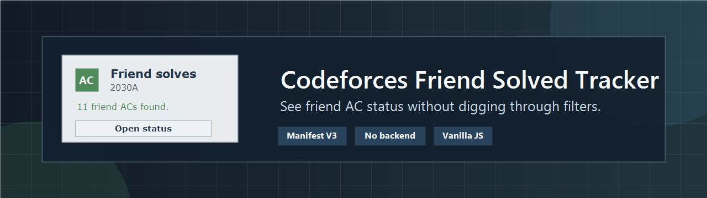

<div align="center">



<br/>
<br/>

# Codeforces Friend Solved Tracker

**A Chrome extension that tells you how many friends cracked a problem — without touching a single filter.**

<br/>

[](https://developer.chrome.com/docs/extensions/mv3/)
[](https://developer.mozilla.org/en-US/docs/Web/JavaScript)
[](#privacy)
[](https://codeforces.com)
[](LICENSE)

<br/>

[**Install**](#install) · [**Features**](#features) · [**Supported Pages**](#supported-pages) · [**Privacy**](#privacy) · [**Roadmap**](#roadmap)

</div>

---

## The Problem

You're grinding Codeforces. You open a problem. You want to know — *did any of my friends solve this already?*

The official way: navigate to the status page, filter by friends, filter by accepted. That's five clicks and a page load every single time.

**This extension does it in zero.**

---

## Features

| | |
|---|---|
| **Friend count on every problem** | See accepted friend submissions directly on the problem page — no navigation required. |
| **One-click status page** | The `Open status` button jumps straight to Codeforces' official friends-only accepted submissions page. |
| **All page types supported** | Works on problemset, contest, gym, and group contest URLs. |
| **Saved handle fallback** | No API key? Add handles manually and it still works. |
| **API friend import** | Sync your full Codeforces friend list automatically using the official public API. |
| **Zero backend** | Everything runs in your browser. No server. No middleman. |

---

## Install

> Not yet on the Chrome Web Store. Install manually in developer mode — takes under a minute.

1. Download the latest release `.zip` from the [Releases page](../../releases).
2. Extract it to a folder.
3. Open `chrome://extensions` in your browser.
4. Enable **Developer mode** (toggle in the top right).
5. Click **Load unpacked**.
6. Select the extracted folder that contains `manifest.json`.

The widget will appear the next time you open any Codeforces problem page.

---

## Supported Pages

```
https://codeforces.com/problemset/problem/<contestId>/<index>
https://codeforces.com/contest/<contestId>/problem/<index>
https://codeforces.com/gym/<contestId>/problem/<index>
https://codeforces.com/group/<groupCode>/contest/<contestId>/problem/<index>
```

---

## Privacy

- No tracking — your usage is never recorded.
- No analytics — no event pings, no telemetry.
- No external backend — your data never leaves your browser.
- API credentials, if used, live in your browser's storage only.
- The extension only reads Codeforces pages and API responses needed to render the widget.

---

## Notes

- You must be logged in on Codeforces for the `friends=on` filter to reflect your actual friend list.
- This extension intentionally does not display solution code — only counts and a link to the official filtered page.
- Avoid using this during live contests or virtual participation.

---

## Built With

- Chrome Extension Manifest V3
- Vanilla JavaScript
- Codeforces Public API
- Codeforces Status Pages

---

## Contributing

Issues and PRs are welcome. If you find a URL pattern that isn't handled or a layout that breaks the widget, open an issue with the full URL.

---

<div align="center">

Made for competitive programmers who hate clicking through filters.

</div>
